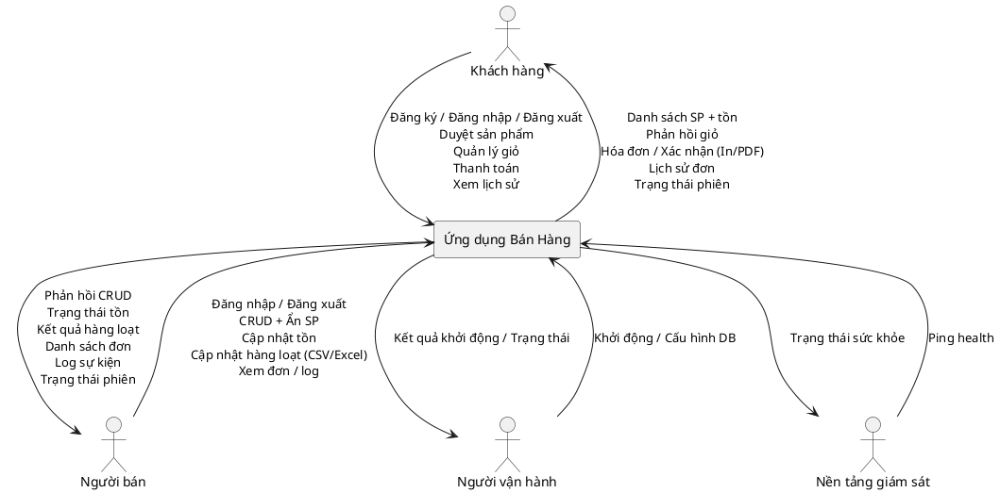

# DFD Level 0 (Context Diagram) Chi Tiết – Ứng Dụng Bán Hàng

Phiên bản: 1.0  
Ngày cập nhật: 2025-11-19  
Tài liệu này mô tả chi tiết sơ đồ DFD Level 0 (Context Diagram) cho hệ thống bán hàng trong repository. Level 0 xem hệ thống như một tiến trình duy nhất "Ứng dụng Bán Hàng" và mô tả các dòng dữ liệu qua biên hệ thống với các tác nhân bên ngoài.

---
## 1. Mục đích của Level 0
Level 0 giúp:
- Xác định rõ ranh giới hệ thống (boundary) so với môi trường bên ngoài.
- Thống nhất các luồng dữ liệu chính được hỗ trợ trong phạm vi phiên bản hiện tại.
- Cung cấp nền tảng cho việc phân rã xuống Level 1/2 và thiết kế API hoặc event.
- Là điểm kiểm tra đối chiếu với use case và yêu cầu chức năng (functional requirements).

---
## 2. Tác nhân bên ngoài (External Entities)
| Actor             | Mô tả vai trò                   | Động cơ chính                                  | Mức tương tác  | Ghi chú                                                                         |
|-------------------|---------------------------------|------------------------------------------------|----------------|---------------------------------------------------------------------------------|
| Khách hàng        | Người dùng cuối mua sản phẩm    | Tìm, thêm giỏ, thanh toán, xem lịch sử         | Cao            | Cần phiên đã xác thực cho hầu hết thao tác (trừ duyệt công khai nếu sau này mở) |
| Người bán         | Quản trị nội dung & tồn kho     | Quản lý danh mục, điều chỉnh tồn, theo dõi đơn | Trung bình/Cao | Có thể có phân quyền nâng cao (ROLE_MERCHANT)                                   |
| Người vận hành    | Khởi tạo & bảo trì hệ thống     | Khởi động, cấu hình DB, giám sát cơ bản        | Thấp           | Tác vụ không thường xuyên                                                       |
| Nền tảng giám sát | Công cụ/agent kiểm tra sức khỏe | Gửi ping health, thu thập trạng thái           | Thấp           | Chỉ đọc, không thay đổi dữ liệu                                                 |

---
## 3. Tổng quan tiến trình trung tâm
"Ứng dụng Bán Hàng" tại Level 0 đại diện cho toàn bộ logic nghiệp vụ bên trong (các tiến trình P1..P9 ở Level 1). Nó thực hiện:
- Xác thực danh tính và phiên.
- Cung cấp thông tin sản phẩm & tồn kho.
- Quản lý giỏ hàng và tạo đơn.
- Quản lý CRUD sản phẩm, tồn kho.
- Cung cấp log & health snapshot.

---
## 4. Danh sách luồng dữ liệu (Data Flows) chính
Mỗi luồng gán một mã DF-XXX để truy vết:

| Mã     | Từ Actor          | Đến Hệ thống | Dữ liệu vào                               | Khi nào                | Yêu cầu liên quan                          |
|--------|-------------------|--------------|-------------------------------------------|------------------------|--------------------------------------------|
| DF-001 | Khách hàng        | Ứng dụng     | Thông tin đăng ký (email, mật khẩu)       | Tạo tài khoản          | F-CUS-001                                  |
| DF-002 | Khách hàng        | Ứng dụng     | Thông tin đăng nhập (email, mật khẩu)     | Bắt đầu phiên          | F-CUS-002                                  |
| DF-003 | Khách hàng        | Ứng dụng     | Yêu cầu duyệt / lọc sản phẩm              | Truy vấn danh sách     | F-CUS-003, F-CUS-004                       |
| DF-004 | Khách hàng        | Ứng dụng     | Thao tác giỏ (thêm/xóa/cập nhật)          | Trong phiên mua        | F-CUS-005, F-CUS-006, F-CUS-007, F-SYS-003 |
| DF-005 | Khách hàng        | Ứng dụng     | Yêu cầu thanh toán                        | Checkout               | F-CUS-008..010, F-CUS-012                  |
| DF-006 | Khách hàng        | Ứng dụng     | Yêu cầu xem lịch sử đơn                   | Sau mua / tra cứu      | F-CUS-011                                  |
| DF-007 | Người bán         | Ứng dụng     | Thông tin đăng nhập                       | Bắt đầu phiên quản trị | F-MER-001                                  |
| DF-008 | Người bán         | Ứng dụng     | CRUD sản phẩm (create/update/delete/hide) | Quản lý danh mục       | F-MER-001, F-MER-005                       |
| DF-009 | Người bán         | Ứng dụng     | Cập nhật tồn kho (số lượng, batch)        | Điều chỉnh tồn         | F-MER-002                                  |
| DF-010 | Người bán         | Ứng dụng     | Yêu cầu xem danh sách đơn                 | Theo dõi bán hàng      | F-MER-003                                  |
| DF-011 | Người bán         | Ứng dụng     | Yêu cầu xem log                           | Audit / kiểm tra       | F-MER-006                                  |
| DF-012 | Người vận hành    | Ứng dụng     | Yêu cầu khởi động/cấu hình                | Deploy / restart       | F-SYS-006, F-SYS-007                       |
| DF-013 | Nền tảng giám sát | Ứng dụng     | Ping health                               | Định kỳ                | F-SYS-008                                  |
| DF-014 | Khách hàng        | Ứng dụng     | Yêu cầu đăng xuất                         | Kết thúc phiên         | F-CUS-013, F-SYS-002                       |
| DF-015 | Người bán         | Ứng dụng     | Yêu cầu đăng xuất                         | Kết thúc phiên         | F-SYS-002                                  |
| DF-016 | Người bán         | Ứng dụng     | Cập nhật hàng loạt (CSV/Excel)            | Quản lý danh mục       | F-MER-004                                  |

Luồng ra từ hệ thống:

| Mã     | Từ Hệ thống | Đến Actor         | Dữ liệu trả về                          | Yêu cầu liên quan               | Ghi chú                       |
|--------|-------------|-------------------|-----------------------------------------|---------------------------------|-------------------------------|
| DF-101 | Ứng dụng    | Khách hàng        | Token / trạng thái phiên                | F-CUS-002, F-CUS-013, F-SYS-002 | Đảm bảo hết hạn tự động       |
| DF-102 | Ứng dụng    | Khách hàng        | Danh sách sản phẩm + tồn                | F-CUS-003, F-CUS-004            | Có thể phân trang             |
| DF-103 | Ứng dụng    | Khách hàng        | Phản hồi giỏ (trạng thái, lỗi tồn)      | F-CUS-005..007, NF-CUS-001      | Thời gian phản hồi <500ms     |
| DF-104 | Ứng dụng    | Khách hàng        | Hóa đơn / xác nhận đơn                  | F-CUS-008..010, F-CUS-012       | Ghi log kèm ID đơn            |
| DF-105 | Ứng dụng    | Khách hàng        | Lịch sử / chi tiết đơn                  | F-CUS-011                       | Có thể lọc theo thời gian     |
| DF-106 | Ứng dụng    | Người bán         | Token / trạng thái phiên                | F-MER-001, F-SYS-002            | Giới hạn quyền theo role      |
| DF-107 | Ứng dụng    | Người bán         | Phản hồi CRUD sản phẩm                  | F-MER-001, F-MER-005            | Bao gồm lỗi xác thực          |
| DF-108 | Ứng dụng    | Người bán         | Trạng thái tồn kho mới                  | F-MER-002                       | Có thể push realtime          |
| DF-109 | Ứng dụng    | Người bán         | Danh sách đơn                           | F-MER-003                       | Có phân trang & lọc           |
| DF-110 | Ứng dụng    | Người bán         | Log sự kiện                             | F-MER-006, F-SYS-008            | Mask dữ liệu nhạy cảm         |
| DF-111 | Ứng dụng    | Người vận hành    | Kết quả khởi động / cấu hình            | F-SYS-006, F-SYS-007            | Gồm lỗi nếu DB không khả dụng |
| DF-112 | Ứng dụng    | Nền tảng giám sát | Trạng thái sức khỏe (status, timestamp) | F-SYS-008, NF-SYS-002           | Không trả dữ liệu người dùng  |
| DF-113 | Ứng dụng    | Người bán         | Kết quả cập nhật hàng loạt              | F-MER-004                       | Tổng hợp thành công/lỗi       |

---
## 5. Biên hệ thống & Quyết định thiết kế chính
| Chủ đề           | Quyết định                           | Lý do                                     |
|------------------|--------------------------------------|-------------------------------------------|
| Xác thực         | Thực hiện nội bộ (password hash)     | Đơn giản, tránh phụ thuộc sớm             |
| Thanh toán       | Nội bộ giả lập, chưa tách gateway    | Giảm phức tạp giai đoạn đầu               |
| Log & Health     | Một điểm cuối chung (P8 nội bộ)      | Tối thiểu để giám sát                     |
| Tồn kho realtime | Đẩy sự kiện khi thay đổi (ở Level 1) | Trải nghiệm người dùng & tránh dữ liệu cũ |
| Session          | Token cấp ở DF-101/106               | Chuẩn REST/SPA và dễ mở rộng              |

---
## 6. Bảo mật & Phi chức năng tại Level 0
| Khía cạnh                | Mô tả                                   | Yêu cầu                |
|--------------------------|-----------------------------------------|------------------------|
| Bảo mật truyền           | Sử dụng HTTPS (triển khai thực tế)      | NF-SYS-002             |
| Bảo vệ mật khẩu          | Hash + salt, không log plaintext        | NF-SYS-001             |
| Thời gian phản hồi giỏ   | <500ms trung bình                       | NF-CUS-001             |
| Tính nhất quán tồn kho   | Cập nhật atomic khi checkout            | NF-CUS-003, NF-MER-002 |
| Khả dụng health endpoint | Trả về mã trạng thái đơn giản (UP/DOWN) | F-SYS-008              |

---
## 7. Truy vết sang Use Case
| Use Case                       | Luồng liên quan (ví dụ)   |
|--------------------------------|---------------------------|
| UC-CUS-001 Đăng ký             | DF-001, DF-101            |
| UC-CUS-002 Quản lý giỏ         | DF-004, DF-103            |
| UC-CUS-003 Thanh toán          | DF-005, DF-104            |
| UC-CUS-004 Xem lịch sử         | DF-006, DF-105            |
| UC-GEN-003 Đăng xuất           | DF-101 (hết hạn / revoke) |
| UC-MER-001 Đăng nhập người bán | DF-007, DF-106            |
| UC-MER-002 Quản lý sản phẩm    | DF-008, DF-107            |
| UC-MER-003 Quản lý tồn kho     | DF-009, DF-108            |
| UC-MER-004 Xem đơn bán         | DF-010, DF-109            |
| UC-MER-005 Xem log             | DF-011, DF-110            |
| UC-SYS-001 Khởi động hệ thống  | DF-012, DF-111            |
| UC-SYS-002 Health check        | DF-013, DF-112            |

---
## 8. Giả định & Ngoại lệ
- Không có tác nhân ngoài thanh toán bên thứ ba ở phiên bản này.
- Không hỗ trợ khách vãng lai checkout (giỏ yêu cầu đăng nhập – F-SYS-003).
- Health check không bao gồm metric chi tiết (CPU/memory) – chỉ trạng thái tổng hợp.
- Log trả về cho người bán được lọc theo quyền, không chứa dữ liệu người dùng khác.

---
## 9. Rủi ro & Hướng giảm thiểu (Context Level)
| Rủi ro                         | Tác động           | Giảm thiểu sơ bộ                      |
|--------------------------------|--------------------|---------------------------------------|
| Tắc nghẽn sản phẩm & tồn kho   | Chậm trải nghiệm   | Cache đọc + event push                |
| Lạm dụng endpoint log          | Tiết lộ thông tin  | Phân quyền + mask dữ liệu             |
| Tấn công brute-force đăng nhập | Tăng tải + bảo mật | Rate limit, lock tạm thời             |
| Mất đồng bộ tồn khi thanh toán | Sai số tồn kho     | Giao dịch / kiểm tra lại trước commit |

---
## 10. Tương lai mở rộng từ Level 0
| Mở rộng            | Mô tả                                                     |
|--------------------|-----------------------------------------------------------|
| Gateway thanh toán | Thêm tác nhân mới "Payment Provider"                      |
| Email/SMS service  | Thêm luồng xác nhận đơn ra ngoài                          |
| BI / Analytics     | Thêm luồng xuất dữ liệu đơn & tồn                         |
| CDN ảnh sản phẩm   | Tách luồng phân phối ảnh thành tác nhân/media store riêng |

---
## 11. Tóm tắt
Level 0 xác định 4 tác nhân chính và 12 luồng vào / 12 luồng ra cốt lõi. Những luồng này bảo đảm bao phủ các use case chức năng trọng tâm: đăng ký, đăng nhập, duyệt sản phẩm, quản lý giỏ, thanh toán, quản trị sản phẩm & tồn kho, giám sát hệ thống. Các quyết định thiết kế đặt nền cho phân rã chi tiết ở Level 1: mỗi nhóm chức năng sẽ trở thành tiến trình (P1..P9) cùng các kho dữ liệu.

---
## 12. Tham chiếu Diagram
PlantUML context nằm trong: `Diagrams/software_dfd_level0.puml` khối `@startuml DFD_Level_0`.

---
Nếu cần bản tiếng Anh hoặc phân rã bổ sung, hãy yêu cầu tiếp.
