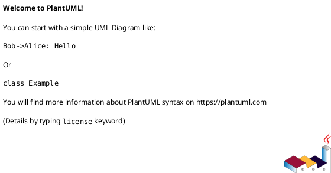

# DFD Level 1 – Phân Rã “Ứng Dụng Bán Hàng”

Phiên bản: 2.0  
Ngày cập nhật: 2025-11-19  
Tài liệu này mô tả DFD Level 1 (decomposition) dựa trên Level 0 đã hoàn tất. Phạm vi chỉ bao gồm chức năng lõi: xác thực, duyệt sản phẩm, giỏ hàng, đơn/checkout, quản lý sản phẩm, tồn kho, log/giám sát và khởi động hệ thống. Không mô hình hóa quy trình trả hàng hoặc khuyến mãi theo yêu cầu.

---
## 1. Mục tiêu
- Phân rã tiến trình “Ứng Dụng Bán Hàng” thành 8 tiến trình nghiệp vụ P1..P8.  
- Cân bằng các luồng DF-xxx ở Level 0 với các tiến trình/ kho dữ liệu cụ thể.  
- Là cơ sở để kiểm thử, thiết kế API, và tiếp tục phân rã Level 2 khi cần.

---
## 2. Phạm vi & Giả định Level 1
| Chủ đề                | Quyết định                                                               |
|-----------------------|--------------------------------------------------------------------------|
| Trả hàng & khuyến mãi | Ngoài phạm vi phiên bản này. Các DF liên quan sẽ được thêm khi mở rộng.  |
| Thanh toán            | Xử lý nội bộ, chưa tích hợp cổng bên thứ ba.                             |
| Session/token         | Do P1 quản lý; các tiến trình khác chỉ nhận thông tin phiên đã hợp lệ.   |
| Health & log          | Gom trong P8 với kho D6 (Logs).                                          |
| Khởi động             | Giai đoạn khởi động không được mô tả ở Level 1 (nằm ngoài Business DFD). |

---
## 3. Tác nhân & cân bằng từ Level 0
| Actor             | Luồng Level 0 liên quan                                | Tiến trình Level 1 tham gia | Ghi chú cân bằng                                                |
|-------------------|--------------------------------------------------------|-----------------------------|-----------------------------------------------------------------|
| Khách hàng        | DF-001, DF-002, DF-003, DF-004, DF-005, DF-006, DF-014 | P1, P2, P3, P4, P7          | Toàn bộ luồng vào/ra đã được gán cho tiến trình tương ứng.      |
| Người bán         | DF-007, DF-008, DF-009, DF-010, DF-011, DF-015, DF-016 | P1, P5, P6, P7, P8          | CRUD sản phẩm, tồn kho, xem đơn/log đều có tiến trình đại diện. |
| Nền tảng giám sát | DF-013, DF-112                                         | P8                          | Health check chỉ thông qua tiến trình log/monitor.              |

---
## 4. Danh sách Tiến trình
| Mã | Tên                  | Trách nhiệm chính                                         | Input từ Actor        | Output đến Actor      | Data Stores    |
|----|----------------------|-----------------------------------------------------------|-----------------------|-----------------------|----------------|
| P1 | Đăng ký / Xác thực   | Đăng ký, đăng nhập, đăng xuất, cấp token, xác thực quyền. | Khách hàng, Người bán | Khách hàng, Người bán | D1, D6         |
| P2 | Duyệt & Tìm Sản Phẩm | Trả danh sách, lọc, kết hợp tồn kho.                      | Khách hàng            | Khách hàng            | D2, D3         |
| P3 | Quản lý Giỏ          | Thêm/sửa/xóa mục giỏ, kiểm tra tồn trước khi ghi.         | Khách hàng            | Khách hàng            | D4, D3, D6     |
| P4 | Thanh toán & Hóa đơn | Chốt giỏ, tạo đơn, cập nhật tồn kho, sinh hóa đơn, log.   | Khách hàng            | Khách hàng            | D4, D5, D3, D6 |
| P5 | Quản lý Sản phẩm     | CRUD thông tin sản phẩm, ẩn/hiện danh mục.                | Người bán             | Người bán             | D2, D6         |
| P6 | Cập nhật Tồn kho     | Điều chỉnh số lượng, xử lý batch, phát sự kiện thay đổi.  | Người bán             | Người bán             | D3, D6         |
| P7 | Xem Đơn & Lịch sử    | Khách & người bán xem đơn, lịch sử mua bán.               | Khách hàng, Người bán | Khách hàng, Người bán | D5, D6         |
| P8 | Log & Giám sát       | Ghi log hệ thống, health check, trả log lọc theo quyền.   | Người bán, Monitor    | Người bán, Monitor    | D6             |

---
## 5. Kho dữ liệu (Data Stores)
| Mã | Tên       | Nội dung                                    | CRUD bởi                       |
|----|-----------|---------------------------------------------|--------------------------------|
| D1 | Users     | email, password_hash, role, metadata        | P1                             |
| D2 | Items     | item_id, name, description, price, status   | P2 (R), P5 (CRUD)              |
| D3 | Inventory | item_id, quantity, updated_at               | P2 (R), P3 (R), P4 (U), P6 (U) |
| D4 | Carts     | cart_id, user_id, items, updated_at         | P3 (CRUD), P4 (R)              |
| D5 | Orders    | order_id, lines, totals, timestamps         | P4 (C), P7 (R)                 |
| D6 | Logs      | actor_id, action, entity, status, timestamp | P1, P3, P4, P5, P6, P7, P8     |

---
## 6. Luồng dữ liệu chính
### 6.1 Actor → Process
| DF     | Nguồn (Actor) | Đích (Process) | Dữ liệu                 | Tiến trình thực hiện        |
|--------|---------------|----------------|-------------------------|-----------------------------|
| DF-001 | Khách hàng    | P1             | Đăng ký                 | Hash + lưu vào D1           |
| DF-002 | Khách hàng    | P1             | Đăng nhập               | Kiểm tra, cấp token         |
| DF-003 | Khách hàng    | P2             | Yêu cầu danh sách / lọc | Trả dữ liệu từ D2+D3        |
| DF-004 | Khách hàng    | P3             | Thao tác giỏ            | Ghi vào D4 sau khi kiểm tồn |
| DF-005 | Khách hàng    | P4             | Yêu cầu thanh toán      | Chốt giỏ, tạo đơn           |
| DF-006 | Khách hàng    | P7             | Yêu cầu lịch sử đơn     | Truy vấn D5                 |
| DF-007 | Người bán     | P1             | Đăng nhập merchant      | Xác thực role               |
| DF-008 | Người bán     | P5             | CRUD sản phẩm           | Ghi D2                      |
| DF-009 | Người bán     | P6             | Cập nhật tồn kho        | Update D3                   |
| DF-010 | Người bán     | P7             | Xem đơn                 | Truy vấn D5                 |
| DF-011 | Người bán     | P8             | Yêu cầu log             | Lọc D6                      |
| DF-013 | Monitor       | P8             | Ping health             | Nhận status                 |
| DF-014 | Khách hàng    | P1             | Đăng xuất               | Hủy token                   |
| DF-015 | Người bán     | P1             | Đăng xuất               | Hủy token                   |
| DF-016 | Người bán     | P5             | Cập nhật hàng loạt      | Batch CRUD                  |

### 6.2 Process → Actor
| DF     | Nguồn (Process) | Đích (Actor)           | Dữ liệu                  |
|--------|-----------------|------------------------|--------------------------|
| DF-101 | P1              | Khách hàng / Người bán | Token, trạng thái phiên  |
| DF-102 | P2              | Khách hàng             | Danh sách sản phẩm + tồn |
| DF-103 | P3              | Khách hàng             | Trạng thái giỏ, lỗi tồn  |
| DF-104 | P4              | Khách hàng             | Hóa đơn / xác nhận đơn   |
| DF-105 | P7              | Khách hàng             | Lịch sử đơn              |
| DF-106 | P1              | Người bán              | Token / quyền            |
| DF-107 | P5              | Người bán              | Kết quả CRUD             |
| DF-108 | P6              | Người bán              | Trạng thái tồn mới       |
| DF-109 | P7              | Người bán              | Danh sách đơn            |
| DF-110 | P8              | Người bán              | Log sự kiện              |
| DF-112 | P8              | Monitor                | Health snapshot          |
| DF-113 | P5              | Người bán              | Báo cáo batch CRUD       |

### 6.3 Process ↔ Data Store
| Process | Data Store | Hành động | Ghi chú                         |
|---------|------------|-----------|---------------------------------|
| P1      | D1         | C/U/R     | Quản lý người dùng              |
| P1      | D6         | Append    | Log đăng ký/đăng nhập/đăng xuất |
| P2      | D2         | R         | Danh sách sản phẩm              |
| P2      | D3         | R         | Số lượng tồn song song          |
| P3      | D4         | C/U/D     | Lưu giỏ theo user               |
| P3      | D3         | R         | Kiểm tra tồn trước ghi          |
| P3      | D6         | Append    | Log thao tác giỏ                |
| P4      | D4         | R         | Đọc giỏ khi checkout            |
| P4      | D5         | C         | Tạo đơn                         |
| P4      | D3         | U         | Giảm tồn                        |
| P4      | D6         | Append    | Log thanh toán                  |
| P5      | D2         | C/U/D     | CRUD sản phẩm                   |
| P5      | D6         | Append    | Log quản lý sản phẩm            |
| P6      | D3         | U         | Điều chỉnh tồn                  |
| P6      | D6         | Append    | Log cập nhật tồn                |
| P7      | D5         | R         | Truy vấn đơn                    |
| P7      | D6         | Append    | Log truy vấn (tùy chọn)         |
| P8      | D6         | Append    | Log health/sự kiện              |

---
## 7. Quan hệ nội bộ (Process to Process)
| Nguồn | Đích        | Mục đích                         |
|-------|-------------|----------------------------------|
| P1    | P3/P4/P5/P6 | Cấp thông tin phiên & quyền      |
| P4    | P7          | Tạo đơn xong -> lịch sử sẵn sàng |
| P6    | P2          | Đẩy sự kiện tồn thay đổi         |
| P5    | P2          | Đẩy sự kiện danh mục             |

---
## 8. Log & Giám sát (P8 & D6)
- Các tiến trình ghi log dạng append; tối thiểu gồm `timestamp, actor_id, action, entity, status`.  
- Monitor chỉ đọc trạng thái tổng hợp (UP/DOWN, latency, build info).  
- Người bán chỉ xem log được lọc theo quyền (không hiển thị dữ liệu nhạy cảm).

---
## 9. Phi chức năng liên quan Level 1
| Khía cạnh          | Mô tả                                                                    |
|--------------------|--------------------------------------------------------------------------|
| Hiệu năng duyệt SP | P2 trả ≤100 sản phẩm <1.5s (NF-SYS-006).                                 |
| Phản hồi giỏ       | P3 phản hồi <500ms trung bình (NF-CUS-001).                              |
| Atomic checkout    | P4 đảm bảo tồn chỉ giảm khi đơn ghi thành công (NF-CUS-003).             |
| Quản lý phiên      | Token hết hạn tự động, hỗ trợ đăng xuất chủ động (F-SYS-002, F-CUS-013). |
| Health check       | P8 trả 200 + payload trạng thái (F-SYS-008, NF-SYS-002).                 |

---
## 10. PlantUML
Xem file `Diagrams/software_dfd_level1.puml` (đã cập nhật tới P1..P8).

---
## 11. Kiểm tra cân bằng Level 0 ↔ Level 1
- Mọi DF-00x (vào) và DF-10x (ra) ở Level 0 đều tìm thấy tiến trình tương ứng ở bảng 6.1 và 6.2.  
- Không có actor mới xuất hiện ở Level 1.  
- Số lượng data store không đổi (D1..D6).  
- Các tiến trình chỉ thao tác data store mà Level 0 đã ám chỉ (Users, Items, Inventory, Carts, Orders, Logs).  
- Các luồng Ops/startup được xử lý ngoài phạm vi Business DFD (tại tài liệu vận hành).

---
## 12. Kết luận
DFD Level 1 hiện bám sát Level 0, lược bỏ các phạm vi chưa triển khai (trả hàng, khuyến mãi, khởi động hệ thống) và mô tả rõ trách nhiệm từng tiến trình. Khi cần chi tiết hơn (ví dụ P4 hoặc P6), có thể tiếp tục phân rã Level 2 dựa trên bảng luồng dữ liệu ở trên.
