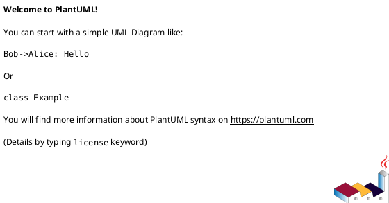

# DFD Level 1 – Phân Rã “Ứng dụng Bán Hàng”

Phiên bản: 2.0  
Ngày cập nhật: 2025-11-19  
Tài liệu này mô tả DFD Level 1 (phân rã) dựa trên Level 0 đã hoàn tất. Phạm vi chỉ bao gồm chức năng lõi: xác thực, duyệt sản phẩm, giỏ hàng, đơn/checkout, quản lý sản phẩm, tồn kho, log/giám sát và khởi động hệ thống. Không mô hình hóa quy trình trả hàng hoặc khuyến mãi theo yêu cầu.

---
## 1. Mục tiêu
- Phân rã tiến trình “Ứng dụng Bán Hàng” thành 8 tiến trình nghiệp vụ P1..P8.  
- Cân bằng các luồng DF-xxx ở Level 0 với các tiến trình/kho dữ liệu cụ thể.  
- Là cơ sở để kiểm thử, thiết kế API, và tiếp tục phân rã Level 2 khi cần.

---
## 2. Phạm vi & Giả định Level 1
| Chủ đề                | Quyết định                                                               |
|-----------------------|--------------------------------------------------------------------------|
| Trả hàng & khuyến mãi | Ngoài phạm vi phiên bản này. Các DF liên quan sẽ được thêm khi mở rộng.  |
| Thanh toán            | Xử lý nội bộ, chưa tích hợp cổng bên thứ ba.                             |
| Session/token         | Do P1 quản lý; các tiến trình khác chỉ nhận thông tin phiên đã hợp lệ.   |
| Giám sát hệ thống     | Gom trong P8, không có kho dữ liệu riêng cho log/metric.                 |
| Khởi động             | Giai đoạn khởi động không được mô tả ở Level 1 (nằm ngoài Business DFD). |

---
## 3. Tác nhân & cân bằng từ Level 0
| Actor      | Luồng Level 0 liên quan                                | Tiến trình Level 1 tham gia | Ghi chú cân bằng                                                           |
|------------|--------------------------------------------------------|-----------------------------|----------------------------------------------------------------------------|
| Khách hàng | DF-001, DF-002, DF-003, DF-004, DF-005, DF-006, DF-014 | P1, P2, P3, P4, P7          | Toàn bộ luồng vào/ra đã được gán cho tiến trình tương ứng.                 |
| Người bán  | DF-007, DF-008, DF-009, DF-010, DF-011, DF-015, DF-016 | P1, P5, P6, P7, P8          | CRUD sản phẩm, tồn kho, xem đơn/log đều có tiến trình đại diện.            |
| Monitor    | DF-013, DF-017, DF-018, DF-114, DF-115, DF-116         | P8                          | Health, realtime metric, cảnh báo và báo cáo được gom vào cùng tiến trình. |

---
## 4. Danh sách Tiến trình
| Mã | Tên                     | Trách nhiệm chính                                                                                     | Input từ Actor        | Output đến Actor      | Data Stores                                                             |
|----|-------------------------|-------------------------------------------------------------------------------------------------------|-----------------------|-----------------------|-------------------------------------------------------------------------|
| P1 | Đăng ký / Xác thực      | Đăng ký, đăng nhập, đăng xuất, cấp token, xác thực quyền.                                             | Khách hàng, Người bán | Khách hàng, Người bán | D1 Người dùng                                                           |
| P2 | Duyệt & Tìm Sản phẩm    | Trả danh sách, lọc, kết hợp giá/tồn từ bảng sản phẩm.                                                 | Khách hàng            | Khách hàng            | D2 Sản phẩm                                                             |
| P3 | Quản lý Giỏ             | Thêm/sửa/xóa mục giỏ, kiểm tra tồn trực tiếp từ bảng sản phẩm.                                        | Khách hàng            | Khách hàng            | D5 Giỏ hàng, D6 Chi tiết giỏ, D2 Sản phẩm                               |
| P4 | Thanh toán & Hóa đơn    | Chốt giỏ, tạo đơn + order items, cập nhật tồn kho, sinh hóa đơn.                                      | Khách hàng            | Khách hàng            | D5 Giỏ hàng, D6 Chi tiết giỏ, D3 Đơn hàng, D4 Chi tiết đơn, D2 Sản phẩm |
| P5 | Quản lý Sản phẩm        | CRUD thông tin sản phẩm, ẩn/hiện danh mục.                                                            | Người bán             | Người bán             | D2 Sản phẩm                                                             |
| P6 | Cập nhật Tồn kho        | Điều chỉnh số lượng, xử lý batch trên bảng sản phẩm.                                                  | Người bán             | Người bán             | D2 Sản phẩm                                                             |
| P7 | Quản lý Đơn hàng (Read) | Khách & người bán xem đơn, lịch sử mua bán.                                                           | Khách hàng, Người bán | Khách hàng, Người bán | D3 Đơn hàng, D4 Chi tiết đơn                                            |
| P8 | Log & Giám sát          | Trả health snapshot, streaming log runtime (không lưu DB), gửi cảnh báo và tổng hợp báo cáo vận hành. | Người bán, Monitor    | Người bán, Monitor    | —                                                                       |

---
## 5. Kho dữ liệu (Data Stores)
| Mã | Tên          | Nội dung                                               | CRUD bởi                                  |
|----|--------------|--------------------------------------------------------|-------------------------------------------|
| D1 | Người dùng   | email, password_hash, role, metadata                   | P1                                        |
| D2 | Sản phẩm     | item_id, name, description, price, stock, picture_path | P2 (R), P3 (R), P4 (U), P5 (CRUD), P6 (U) |
| D3 | Đơn hàng     | order_id, user_id, total_amount, status, timestamps    | P4 (C), P7 (R)                            |
| D4 | Chi tiết đơn | order_item_id, order_id, item_id, quantity, unit_price | P4 (C), P7 (R)                            |
| D5 | Giỏ hàng     | cart_id, user_id/session_id, timestamps                | P3 (CRUD), P4 (R)                         |
| D6 | Chi tiết giỏ | cart_item_id, cart_id, item_id, quantity               | P3 (CRUD), P4 (R)                         |

---
## 6. Luồng dữ liệu chính
### 6.1 Actor → Process
| DF     | Nguồn (Actor) | Đích (Process) | Dữ liệu                                                    | Tiến trình thực hiện                           |
|--------|---------------|----------------|------------------------------------------------------------|------------------------------------------------|
| DF-001 | Khách hàng    | P1             | Thông tin đăng ký (email, mật khẩu, role, metadata)        | Hash + lưu vào D1                              |
| DF-002 | Khách hàng    | P1             | Thông tin đăng nhập (email + mật khẩu)                     | Kiểm tra, cấp token                            |
| DF-003 | Khách hàng    | P2             | Bộ tiêu chí duyệt (từ khóa, bộ lọc)                        | Trả dữ liệu từ D2 (bao gồm giá + tồn)          |
| DF-004 | Khách hàng    | P3             | Yêu cầu cập nhật giỏ (item_id, quantity, thao tác)         | Ghi vào D5/D6 sau khi kiểm tồn trên D2         |
| DF-005 | Khách hàng    | P4             | Yêu cầu checkout (cart_id, phương thức thanh toán)         | Chốt giỏ (D5/D6), tạo đơn (D3/D4), cập nhật D2 |
| DF-006 | Khách hàng    | P7             | Tham số truy vấn lịch sử đơn (range, trạng thái)           | Truy vấn D3 + D4                               |
| DF-007 | Người bán     | P1             | Thông tin đăng nhập merchant (email + mật khẩu)            | Xác thực role                                  |
| DF-008 | Người bán     | P5             | Payload CRUD sản phẩm (item metadata, trạng thái hiển thị) | Ghi D2                                         |
| DF-009 | Người bán     | P6             | Danh sách điều chỉnh tồn (item_id, delta stock)            | Update stock trực tiếp trên D2                 |
| DF-010 | Người bán     | P7             | Bộ lọc danh sách đơn bán (khoảng thời gian, trạng thái)    | Truy vấn D3 + D4                               |
| DF-011 | Người bán     | P8             | Tham số truy vấn log/metric realtime                       | Nhận log/metric thời gian thực (không lưu DB)  |
| DF-013 | Monitor       | P8             | Ping health payload (heartbeat token)                      | Nhận status + metric                           |
| DF-017 | Monitor       | P8             | Tham số báo cáo vận hành (kỳ, định dạng)                   | Sinh báo cáo vận hành                          |
| DF-018 | Monitor       | P8             | Xác nhận cảnh báo / phản hồi xử lý                         | Ghi nhận xử lý cảnh báo                        |
| DF-014 | Khách hàng    | P1             | Token cần hủy                                              | Hủy token                                      |
| DF-015 | Người bán     | P1             | Token merchant cần hủy                                     | Hủy token                                      |
| DF-016 | Người bán     | P5             | Tệp batch sản phẩm (danh sách item + thao tác)             | Batch CRUD trên D2                             |

### 6.2 Process → Actor
| DF     | Nguồn (Process) | Đích (Actor)           | Dữ liệu                                       |
|--------|-----------------|------------------------|-----------------------------------------------|
| DF-101 | P1              | Khách hàng / Người bán | Token + trạng thái phiên                      |
| DF-102 | P2              | Khách hàng             | Danh sách sản phẩm kèm giá & tồn              |
| DF-103 | P3              | Khách hàng             | Ảnh chụp giỏ, kết quả kiểm tồn, thông báo lỗi |
| DF-104 | P4              | Khách hàng             | Xác nhận đơn + hóa đơn chi tiết               |
| DF-105 | P7              | Khách hàng             | Danh sách lịch sử đơn                         |
| DF-106 | P1              | Người bán              | Token + quyền merchant                        |
| DF-107 | P5              | Người bán              | Kết quả CRUD từng sản phẩm                    |
| DF-108 | P6              | Người bán              | Trạng thái tồn mới (item_id, stock hiện tại)  |
| DF-109 | P7              | Người bán              | Danh sách đơn bán / chi tiết tóm tắt          |
| DF-110 | P8              | Người bán              | Luồng log/metric realtime                     |
| DF-112 | P8              | Monitor                | Health snapshot (trạng thái, latency, build)  |
| DF-114 | P8              | Monitor                | Luồng giao dịch/metric realtime               |
| DF-115 | P8              | Monitor                | Cảnh báo bất thường (subscribe + ack)         |
| DF-116 | P8              | Monitor                | Báo cáo vận hành (PDF/CSV + checksum)         |

### 6.3 Process ↔ Data Store
| Process | Data Store | Dữ liệu trao đổi                                      | Ghi chú                            |
|---------|------------|-------------------------------------------------------|------------------------------------|
| P1      | D1         | Hồ sơ người dùng (email, hash, role, metadata)        | Quản lý người dùng và quyền        |
| P2      | D2         | Danh mục sản phẩm kèm tồn                             | Danh sách sản phẩm + tồn           |
| P3      | D5         | Bản ghi giỏ (cart_id, chủ sở hữu, timestamps)         | Lưu giỏ theo user/session          |
| P3      | D6         | Danh sách cart item (item_id, quantity)               | Lưu từng cart item                 |
| P3      | D2         | Tồn và giá sản phẩm cần kiểm tra                      | Kiểm tra tồn trước khi ghi giỏ     |
| P4      | D5         | Snapshot giỏ đã khóa                                  | Đọc giỏ khi checkout               |
| P4      | D6         | Danh sách cart items chuyển sang order                | Đọc cart items để sinh order items |
| P4      | D3         | Bản ghi đơn (order_id, user_id, tổng tiền, status)    | Tạo bản ghi orders                 |
| P4      | D4         | Bản ghi order item (order_item_id, item_id, qty, giá) | Tạo bản ghi order items            |
| P4      | D2         | Thông tin tồn cần giảm                                | Giảm tồn (stock)                   |
| P5      | D2         | Dữ liệu sản phẩm (metadata, giá, trạng thái)          | CRUD sản phẩm                      |
| P6      | D2         | Batch điều chỉnh tồn                                  | Điều chỉnh tồn hàng loạt           |
| P7      | D3         | Danh sách đơn theo tiêu chí                           | Truy vấn orders                    |
| P7      | D4         | Chi tiết order items                                  | Truy vấn chi tiết order items      |

---
## 7. Quan hệ nội bộ (Process to Process)
| Nguồn | Đích        | Thông tin trao đổi                           |
|-------|-------------|----------------------------------------------|
| P1    | P3/P4/P5/P6 | Thông tin phiên đã xác thực + quyền truy cập |
| P4    | P7          | ID đơn mới cùng trạng thái thanh toán        |
| P6    | P2          | Sự kiện tồn thay đổi (item_id, stock mới)    |
| P5    | P2          | Sự kiện danh mục (item metadata cập nhật)    |

---
## 8. Giám sát (P8)
- P8 cung cấp health snapshot và chuyển tiếp log runtime tới các kênh giám sát nhưng không ghi xuống bất kỳ bảng DB nào.
- Monitor chỉ đọc trạng thái tổng hợp (UP/DOWN, latency, build info).
- Người bán chỉ xem log/metric realtime được ủy quyền, không lưu trữ lâu dài.

---
## 9. Phi chức năng liên quan Level 1
| Khía cạnh          | Mô tả                                                                    |
|--------------------|--------------------------------------------------------------------------|
| Hiệu năng duyệt SP | P2 trả ≤100 sản phẩm <1.5s (NF-SYS-006).                                 |
| Phản hồi giỏ       | P3 phản hồi <500ms trung bình (NF-CUS-001).                              |
| Atomic checkout    | P4 đảm bảo tồn chỉ giảm khi đơn ghi thành công (NF-CUS-003).             |
| Quản lý phiên      | Token hết hạn tự động, hỗ trợ đăng xuất chủ động (F-SYS-002, F-CUS-013). |
| Health check       | P8 trả 200 + payload trạng thái (F-SYS-008, NF-SYS-002).                 |

---
## 10. PlantUML
Xem file `Diagrams/software_dfd_level1.puml` (hiện dùng D1 Users, D2 Items, D3 Orders, D4 Order Items, D5 Carts, D6 Cart Items).

---
## 11. Kiểm tra cân bằng Level 0 ↔ Level 1
- Mọi DF-00x (vào) và DF-10x (ra) ở Level 0 đều tìm thấy tiến trình tương ứng ở bảng 6.1 và 6.2.
- Không có actor mới xuất hiện ở Level 1.
- Bộ data store đúng bằng lược đồ thực tế: Users, Items, Orders, Order Items, Carts, Cart Items.
- Các tiến trình chỉ thao tác data store mà Level 0 đã ám chỉ thông qua nghiệp vụ.
- Các luồng Ops/startup được xử lý ngoài phạm vi Business DFD (tại tài liệu vận hành).

---
## 12. Kết luận
DFD Level 1 hiện bám sát Level 0, lược bỏ các phạm vi chưa triển khai (trả hàng, khuyến mãi, khởi động hệ thống) và mô tả rõ trách nhiệm từng tiến trình. Khi cần chi tiết hơn (ví dụ P4 hoặc P6), có thể tiếp tục phân rã Level 2 dựa trên bảng luồng dữ liệu ở trên.

---
## 13. Định hướng Level 2
| Tiến trình Level 1 | Lý do cần Level 2                          | Nhóm subprocess gợi ý                                       |
|--------------------|--------------------------------------------|-------------------------------------------------------------|
| P1 Auth            | Nhiều bước (đăng ký, đăng nhập, cấp token) | P1.1 Validate input, P1.2 Lookup user, P1.3 Issue token     |
| P3 Cart            | CRUD giỏ + kiểm tồn                        | P3.1 Fetch cart, P3.2 Validate stock, P3.3 Persist cart     |
| P4 Checkout        | Chốt giỏ → đơn → cập nhật tồn              | P4.1 Validate cart, P4.2 Create order, P4.3 Adjust stock    |
| P5 Items CRUD      | CRUD + upload hàng loạt                    | P5.1 Create/Update, P5.2 Delete/Hide, P5.3 Bulk import      |
| P6 Stock Ops       | Batch cập nhật, broadcast event            | P6.1 Manual adjust, P6.2 Batch upload, P6.3 Publish event   |
| P7 Orders Read     | Khác vai trò (customer vs merchant)        | P7.1 Customer history, P7.2 Merchant list, P7.3 Detail view |
| P2, P8             | Đã đủ chi tiết ở Level 1                   | —                                                           |

Chi tiết Level 2 được mô tả trong `software_dfd_level2.md` và các sơ đồ tương ứng trong `Diagrams/software_dfd_level2_*.puml`.
